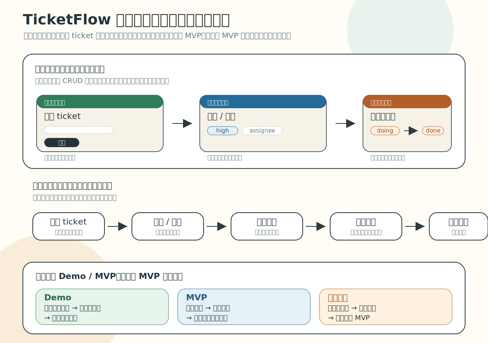
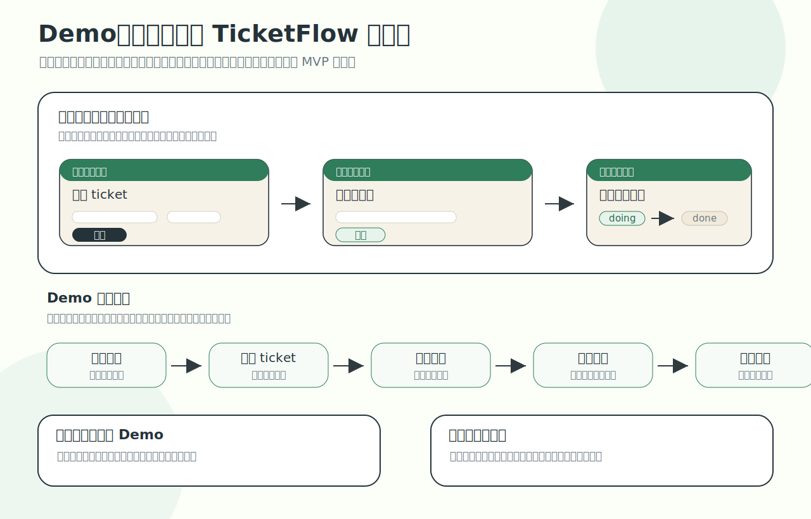
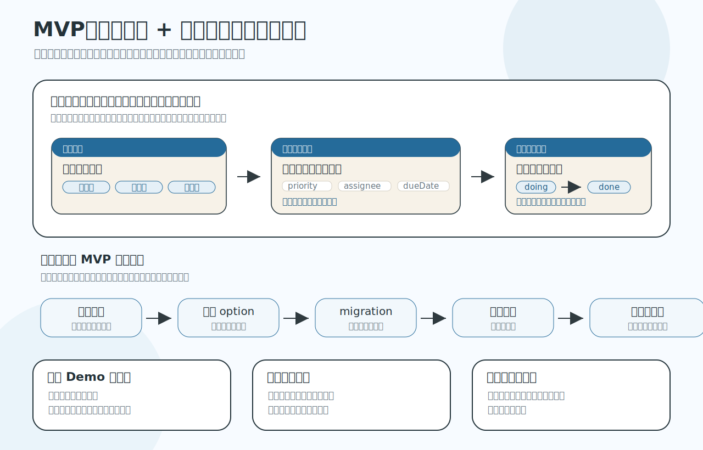
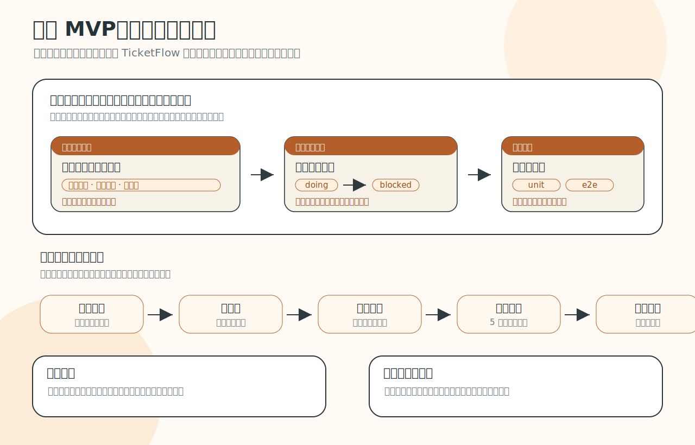

# TicketFlow 作业总文：产品定义、验收与迭代路径

> 这是 `TicketFlow` 的实战作业总文，覆盖 4 次实战练习的连续推进。  
> 目标是：用一份文档讲清“这是什么、怎么验收、怎么从 Demo 长到更强 MVP”。

---

## Part A. 作业定位与产品主线

### 1) 一句话定义

`TicketFlow` 是一个给小团队使用的轻量 ticket 流转系统：

- 有人提交事情
- 有人接住并调度
- 有人完成处理
- 相关人看到一致结果

### 2) 它不是什么

它不是：

- 一个所有人看同一页的共享待办壳
- 一个纯 CRUD 页面练习
- 一个一次性 demo 玩具
- 一个一上来就做重的 Jira 替代品

这道作业的核心不是“功能很多”，而是：

> **把三角色交接主线做成立，并且逐步变真实。**

### 3) 三角色与关系约束

固定三角色：

- `提交者`
- `调度者`
- `完成者`

固定两条关系约束：

1. `提交者` 必须和后面的处理侧不同。  
2. `调度者` 与 `完成者` 可以是同一实际人员，但产品画面里仍然要有两个清楚视角。

可以用一句话记：

- 现实里最少可只有两个人，但产品上仍要呈现三个清楚视角。

### 4) 第一心智：先看工作台

`TicketFlow` 第一入口心智是三角色工作台：

- 提交者工作台
- 调度者工作台
- 完成者工作台

ticket 详情页可以存在，但默认是工作台里的承载页，不是第一入口心智。

### 5) 作业全景图

这张图要回答的问题：

> **同一个 TicketFlow，如何在同一条主线上从 Demo 长到 MVP，再继续补强。**

阅读顺序建议：

1. 先看上层三角色工作台
2. 再看中层提交 -> 调度 -> 完成
3. 最后看下层成熟度演进（Demo -> MVP -> 更强 MVP）

### 6) 最小故事线

最小故事线（示例）：

1. `提交者` 发现“会议室投影仪坏了”，提交 ticket。
2. `调度者` 看到 ticket，判断优先级并指派。
3. `完成者` 接住 ticket，处理并推进到完成。
4. `提交者` 回来看时，能看到处理状态和结果。

后面的 Demo / MVP 验收，默认都围绕这条“提交 -> 调度 -> 完成”的主线判断。

---

## Part B. Demo 阶段：先让故事成立

### 1) Demo 的目标

Demo 不是“做得多”，而是“做得成立”：

- 三角色视角已经分开
- 主流程已经真实跑通
- 虽然可以很薄，但不能假

### 2) Demo 路径图

这张图要回答的问题：

> **在不依赖复杂登录和重功能前提下，如何证明三角色交接线已经活了。**

### 3) Demo 最低验收（PM视角）

至少满足：

1. 提交者能录入并提交一条 ticket。
2. 调度者能看到该 ticket 并完成一次最小调度动作。
3. 完成者能看到被调度的 ticket 并完成一次最小状态推进。
4. 三个工作台看到的是同一条 ticket 的同一次流转。
5. 即使没有真实登录，角色视角也已经分开。

### 4) Demo 交付物

交付的不只是代码仓库，而是一个“可演示的产品状态”：

- 三个工作台可展示
- 一条完整交接链可现场演示
- 演示时能解释每个角色在做什么

---

## Part C. MVP 阶段：让身份与规则变真实

### 1) MVP 的目标

MVP 不是“比 Demo 多几个页面”，而是：

> **角色身份开始真实影响入口和动作，规则与字段开始承担真实判断。**

### 2) MVP 路径图

这张图要回答的问题：

> **系统从“能演示”走向“能被少量真实事项试用”时，最小必需的变化是什么。**

### 3) MVP 最低验收（PM视角）

至少满足：

1. 有最小角色登录 / 身份区分。
2. 不同角色登录后进入不同工作台。
3. 角色不同，主线动作权限和可见内容不同。
4. `priority / assignee / dueDate` 等关键字段开始进入主线判断。
5. 至少一组关键状态推进有明确规则。
6. 非法推进时有清楚反馈。
7. 提交者能看到与自己相关的结果视图。
8. 登录、字段、规则、反馈一起服务同一条主线。

### 4) MVP 交付物

交付的不只是“功能更多”，而是“可验收价值更真实”：

- 现场能演示角色身份差异
- 现场能演示规则生效与失败反馈
- 现场能解释为什么这版已经从 Demo 进入 MVP

### 5) 更强 MVP 的口径

对外正式口径仍然只有两档：

- `Demo`
- `MVP`

`MVP1 / MVP2` 只用于内部解释“在既有 MVP 上继续补强到了哪里”，不是新增官方层级。

### 6) 强 MVP 路径图

这张图要回答的问题：

> **在已达成 MVP 后，如何沿同一主线继续补高价值缺口，而不换题。**

### 7) 常见补强方向

- 关键规则更稳
- 跨角色一致性更清楚
- 风险提示更明显（高优先级、临近到期）
- 关键路径的测试和质量更扎实
- 演示、验收、交付表达更从容

---

## Part D. 执行边界与最终验收

### 1) 允许发挥的方向

- 三工作台的信息组织
- 调度与完成动作的规则设计
- 优先级/到期风险表达
- 状态反馈与跨角色一致性
- 质量防护与验收表达

### 2) 不建议过早引入的方向

- 完整账号体系
- OAuth
- 外部系统集成
- 文件上传
- 复杂平台化多表

原因不是“永远不做”，而是这些会过早把主线带偏，让同一作业变成不同题目。

### 3) 最终验收清单

#### Demo 验收

- [ ] 三角色工作台清楚存在
- [ ] `提交 -> 调度 -> 完成` 能现场演示跑通
- [ ] 三角色看到同一条流转线
- [ ] 无真实登录情况下仍有角色分视角

#### MVP 验收

- [ ] 最小登录 / 身份区分成立
- [ ] 登录后进入不同角色工作台
- [ ] 关键动作有规则约束
- [ ] 关键字段开始参与真实判断
- [ ] 非法动作有明确反馈
- [ ] 角色差异与主线价值可解释

#### 更强 MVP（内部补强）验收

- [ ] 上一轮关键缺口已被补掉
- [ ] 风险项更可见
- [ ] 测试与质量证据更可信
- [ ] 演示与验收更稳

### 4) 学员快速自检

读完整份文档后，用这 5 句话自检你当前进度：

1. 我的系统是不是已经能清楚呈现提交、调度、完成三角色视角。
2. 我的 `Demo` 是不是真的把主线跑通了，而不是只做了几张页面。
3. 我的 `MVP` 是不是真的有最小登录、角色差异、规则约束和失败反馈。
4. 我的后续补强是不是仍然沿同一条主线，而不是换题乱飞。
5. 我能不能把“为什么它是 Demo / MVP / 更强 MVP”讲清楚并现场演示。
